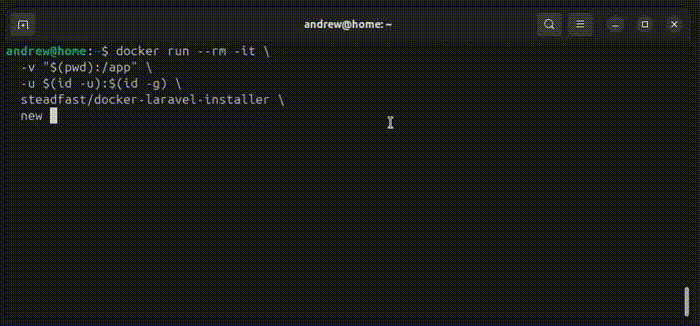

# Laravel Installer - Docker Image


A minimal and ready-to-use Docker image to quickly scaffold new Laravel projects using the official Laravel Installer.

## Features

- Based on the official Laravel Sail Docker image.
- Includes the latest [Laravel Installer](https://github.com/laravel/installer).
- Clean and lightweight.
- Ready to use with `docker run`.

## Usage
To create a new Laravel project using this image, run the following command:
```bash
docker run --rm -it \
  -v "$(pwd):/app" \
  -u $(id -u):$(id -g) \
  steadfast/docker-laravel-installer \
  new example
```

> [!TIP]
> Replace `example` with the name of the folder where your new Laravel project should be created.
> The folder will be created inside your current working directory.

## Demo


## Background

Although Laravel provides an official Docker base image for development, there is **no dedicated image that includes the latest version of the Laravel Installer**.

Since the Laravel Installer is updated frequently with new features, I decided to create this image to always include the **most up-to-date version** — cloned directly from the official GitHub repository at build time.
